## 🔴 Attack Flow

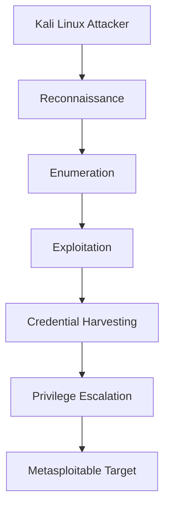
## 🔍 Reconnaissance

### 🖥 Host Discovery
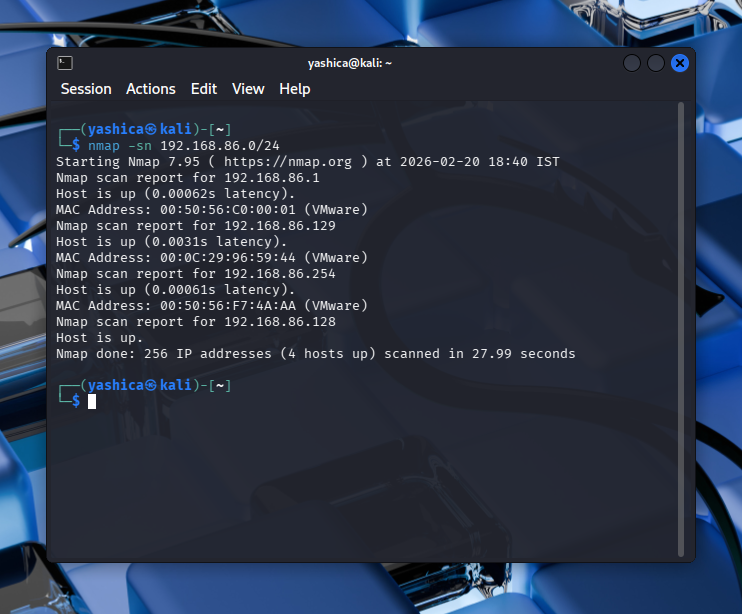

### 🚪 Port Scanning

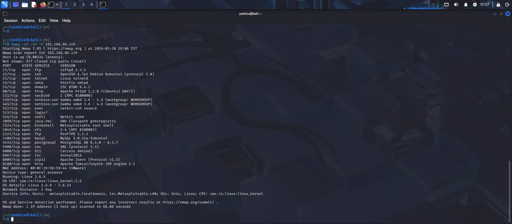

## 🧠 Enumeration

### 📂 FTP Enumeration
- Banner Grabbing
- Version Identification

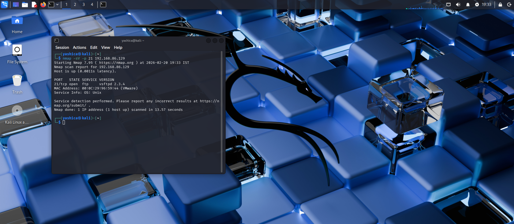

---
### 🔑 SSH Enumeration
- Service detection
- User validation attempts

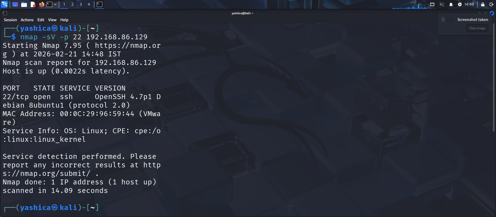

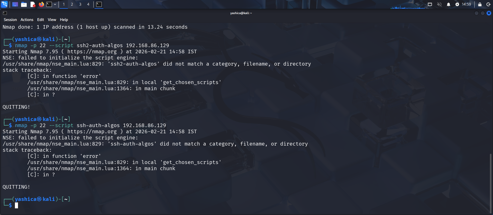

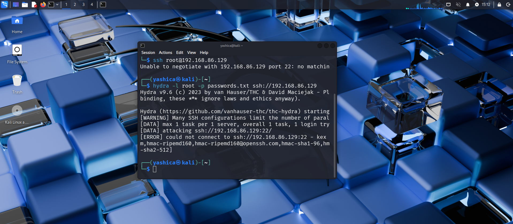

### 🌐 Web Enumeration
- Directory discovery
- Service probing
- Web application mapping

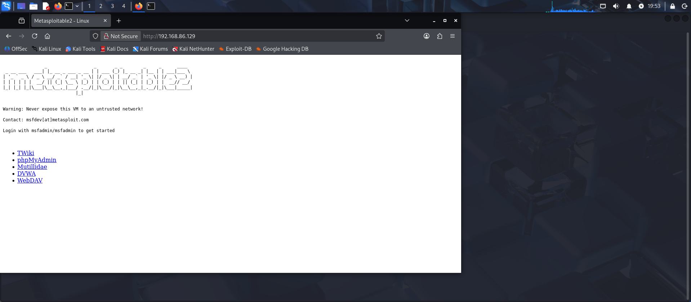
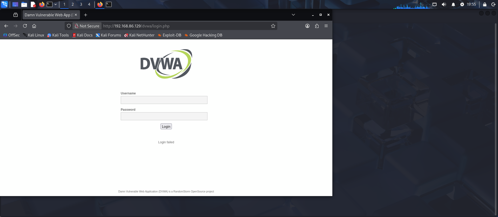
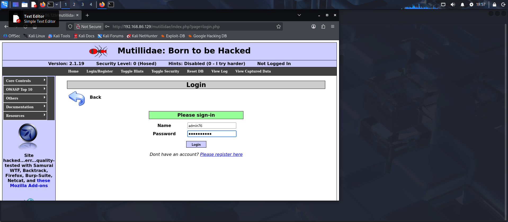
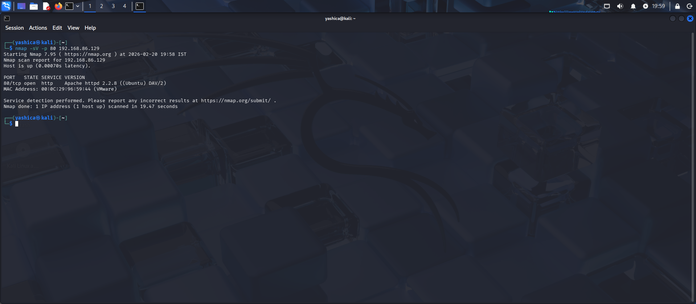

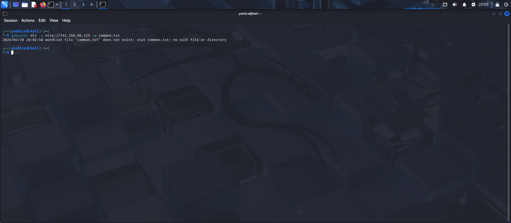
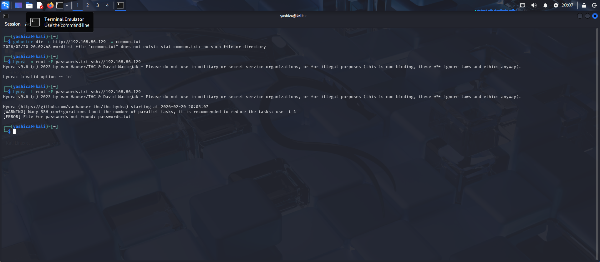
# Internal Network Compromise Simulation (Red Team Lab)

## Overview
This project simulates a real-world internal network attack performed in a controlled lab environment using Kali Linux and Metasploitable.

The objective was to demonstrate the full red team lifecycle:
Reconnaissance → Enumeration → Exploitation → Post-Exploitation 

---

## Lab Setup
- Attacker: Kali Linux
- Target: Metasploitable 2
- Environment: Virtual lab
- Network: Internal simulated network

---

## Attack Phases

### 1. Reconnaissance
- Host discovery
- Network scanning
- Port scanning

### 2. Enumeration
- FTP enumeration
- SSH enumeration
- Web service discovery

### 3. Exploitation
- Vulnerability exploitation
- Reverse shell access

### 4. Post Exploitation
- Credential harvesting
- Privilege escalation
- Persistence

---

## Tools Used
- Nmap
- Netcat
- Metasploit
- Hydra
- Wireshark

---

## Skills Demonstrated
- Network reconnaissance
- Service enumeration
- Exploitation techniques
- Credential harvesting
- Privilege escalation
- Red team workflow

---

## Disclaimer
This project was conducted in a controlled lab environment for learning and ethical cybersecurity purposes only.
